# Laboratotio 6: Pruebas de Rendimiento con JMeter

Automatizar pruebas de rendimiento de aplicaciones web utilizando JMeter + BlazeMeter.
Probaré el rendimiento de mi AppWeb con JMeter y usaré Thread para simular muchos usarios con 10 ciclos de ejecución.

## Pre - requisitos

1. JMeter + Java8+
2. BlazeMeter
3. AppWeb NodeJS
4. Brave Browser

## Instalación de los pre - requisitos

### 1. Descargar JMeter

Descargar el [JMeter](https://jmeter.apache.org/download_jmeter.cgi)

### 2. Instalar la extensión BlazerMeter

Descargar la extensióm [BlazeMeter](https://chrome.google.com/webstore/detail/blazemeter-the-continuous/mbopgmdnpcbohhpnfglgohlbhfongabi)

### 3. Cargar una AppWeb NodeJS en el puerto 3000

Podemos usar cualquier App para probar el rendimiento en mi AppWeb usaré el Login con autenticación de usuario y contraseña; FeedBack Box y SignUp.

### 4. Instalar Brave Browser

BlazeMeter requiere que un Navegador web se encuentre instalado para poder correr las pruebas, usé Brave Browser para correr las pruebas.

## Uso de BlazeMeter

Usaremos BlazeMeter para grabar nuestra interacción con la AppWeb, la inteacción es similar a Selenium, pero con una interfaz más amigable.

* Iniciar la prueba:
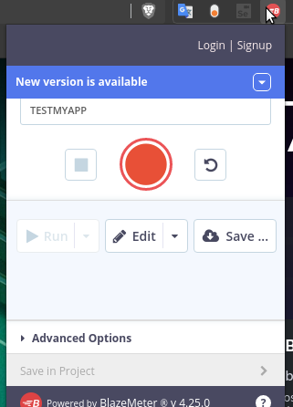

1.Debemos mantener el navegador abierto y blaze abierto mientras ejecutamos todos los pasos que serán grabados en el archivo de registro.
2.BlazeMeter generará un archivo `.jmx` que importaremos en JMeter.

## AppWeb de Prueba

La prueba constará de cuatro páginas:

### 1. Cargar la página de index

* Cargar la página de index
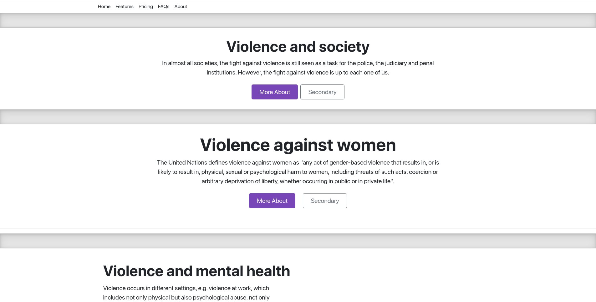

### 2. Cargar la página de login

* Cargar la página de login
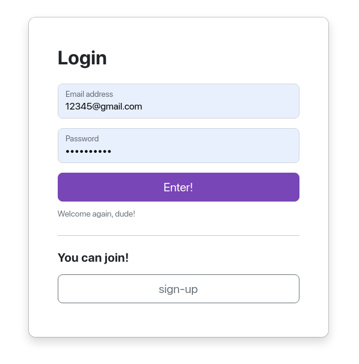

### 3. Cargar la página de feedBack

* Cargar la página de feedBack
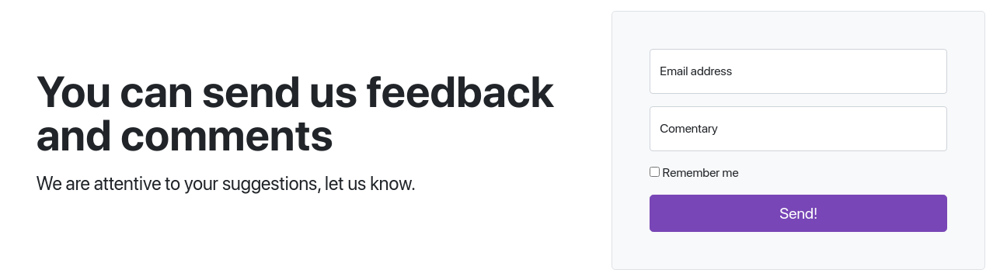

### 4. Cargar la página de dashboard

* Cargar la página de dashboard
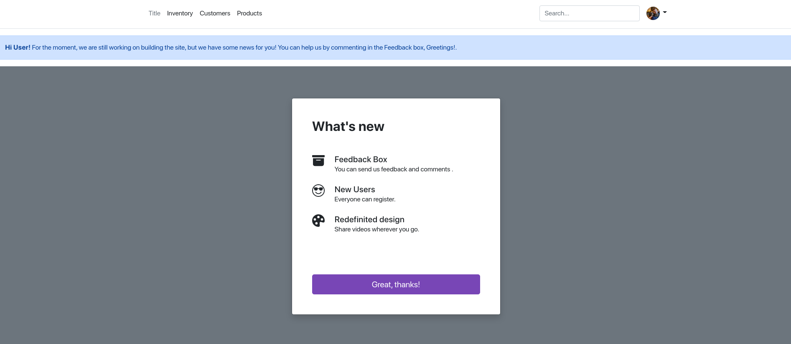

### 5. Salir del dashboard con signout

* Salir del dashboard con signUp
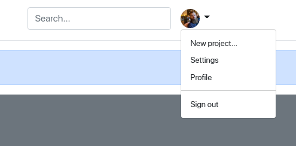

## JMeter

después de importar el archivo `.jmx` generado por BlazeMeter en JMeter.

### 1. El archivo `.jmx` configurará todas las pruebas, URL, PHATS y componentes

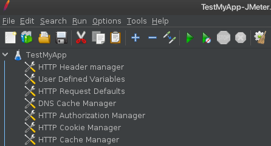

### 2. Configurar el grupo de Threads 

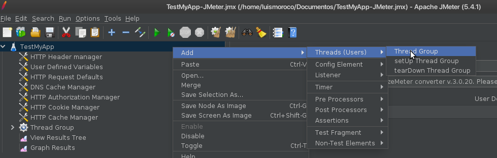

* Configurar el grupo de Threads para 10 usuaarios y 10 ciclos

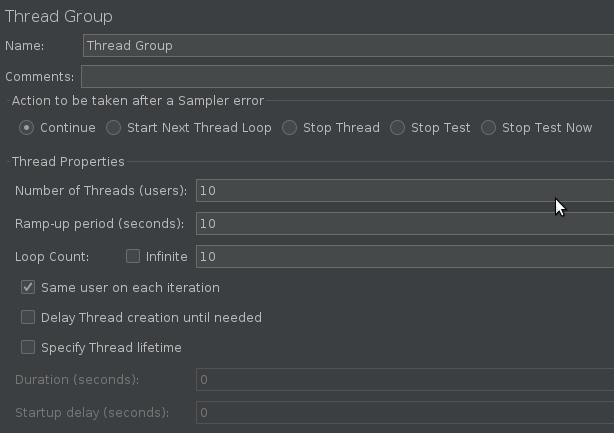

### 3. Configurar el listener de los resultados

* Configurar el árbol de resultados

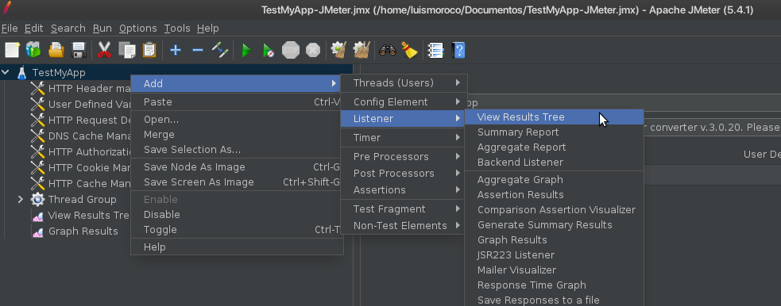

* Configurar el Grafico de resultados para hacerlo más fácil de interpretar

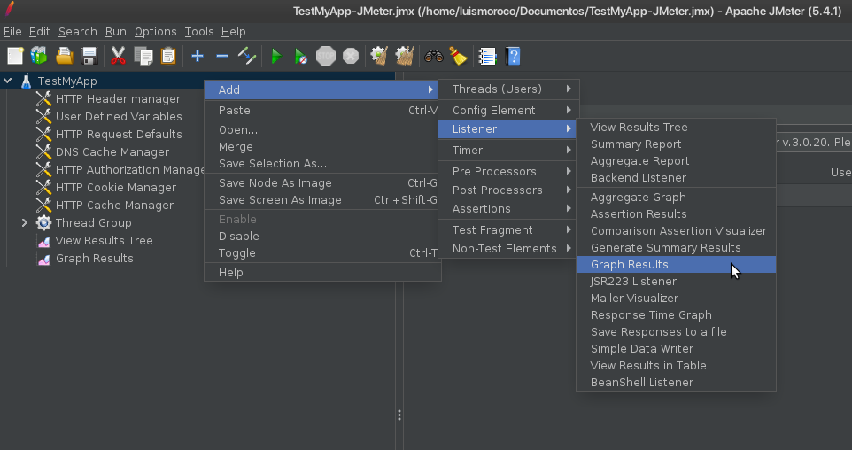

### 4. Ejecutar la prueba

* Ejecutar la prueba

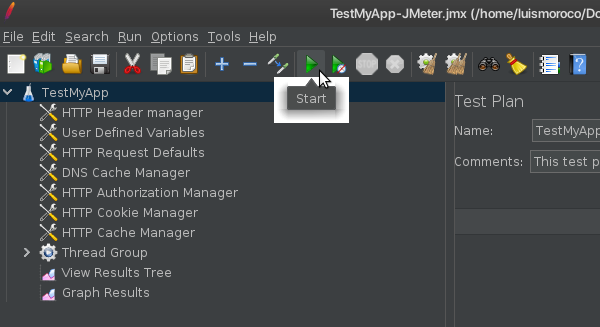

## Resultados

* Árbol de resultados

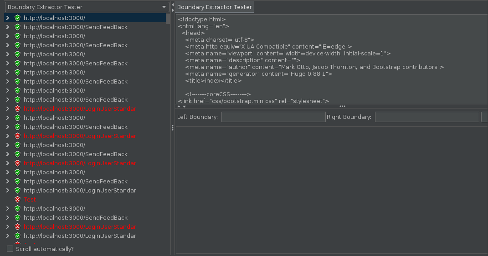

* Grafico de resultados

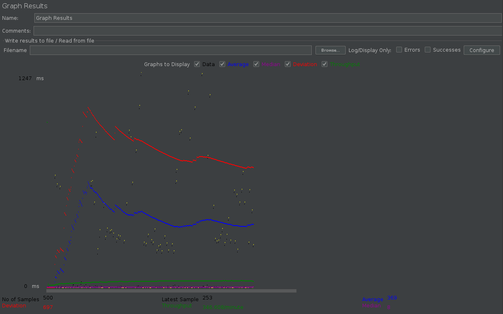